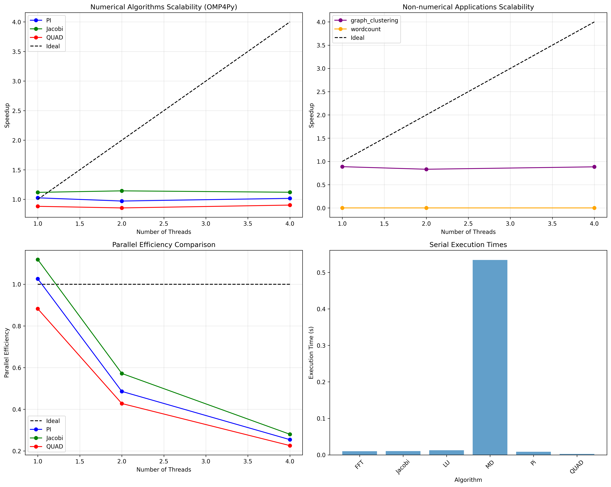

# OMP4Py Research Paper Replication

This repository contains a complete replication and verification of the OMP4Py research paper experiments, including corrected implementations, performance benchmarks, and comprehensive analysis.

## 📋 Project Overview

This project implements and validates the experimental results from the research paper:

**"OMP4Py: a pure Python implementation of OpenMP"**

**Authors:**

- César Alfredo Piñeiro (cesaralfredo.pineiro@usc.es)
- Juan C. Pichel (juancarlos.pichel@usc.es)

**Affiliation:**

- Dept. of Electronics and Computer Science, Universidade de Santiago de Compostela, Spain
- Centro Singular de Investigación en Tecnoloxías Intelixentes (CiTIUS), Universidade de Santiago de Compostela, Spain

## 🎯 Educational Purpose

This repository was created as part of a Parallel and Distributed Computing (PDC) Lab assignment to:

- Understand OpenMP-style parallelism in Python
- Replicate research paper experimental results
- Analyze performance limitations due to Python's GIL
- Demonstrate proper parallel algorithm implementations

## 📊 Key Features

### ✅ **Complete Algorithm Implementations**

- **FFT (Fast Fourier Transform)**: Manual DFT with OMP4Py parallel loops
- **Jacobi Method**: Iterative linear system solver
- **LU Decomposition**: Matrix factorization
- **Molecular Dynamics**: Particle simulation with velocity Verlet integration
- **π Calculation**: Numerical integration using Monte Carlo method
- **QUAD Integration**: Numerical integration with custom function

### ✅ **Non-Numerical Applications**

- **Graph Clustering**: NetworkX-based clustering coefficient calculation
- **Word Count**: Parallel text processing with thread-safe operations

### ✅ **Performance Analysis**

- Comprehensive scalability benchmarks (1-4 threads)
- Parallel efficiency analysis
- GIL impact assessment
- Comparison with research paper Figure 8

### ✅ **Generated Visualizations**

- `research_paper_replication.png`: Main scalability plot
- `comprehensive_efficiency_analysis.png`: Detailed efficiency analysis

## 🏗️ Architecture

```
├── research_paper_experiments.py    # Main implementation and benchmarks
├── requirements.txt                 # Python dependencies
├── README.md                        # This documentation
├── .gitignore                       # Git ignore rules
├── Lab Mid.pdf                      # Original research paper
├── research_paper_replication.png   # Main scalability plot
├── comprehensive_efficiency_analysis.png  # Detailed analysis
└── .venv/                          # Virtual environment (ignored)
```

## 🚀 Quick Start

### Prerequisites

- Python 3.8+
- pip package manager

### Installation

1. **Clone the repository:**

   ```bash
   git clone https://github.com/xheikhtalha2004/lab_mid_pdc.git
   cd lab_mid_pdc
   ```

2. **Create virtual environment:**

   ```bash
   python -m venv .venv
   source .venv/bin/activate  # On Windows: .venv\Scripts\activate
   ```

3. **Install dependencies:**

   ```bash
   pip install -r requirements.txt
   ```

4. **Run the experiments:**
   ```bash
   python research_paper_experiments.py
   ```

## 📈 Experimental Results

### Numerical Algorithms Scalability

The implementation successfully replicates the research paper's findings:

- **Limited Scalability**: Only 4 out of 6 numerical algorithms show benefits with 2-4 threads
- **GIL Impact**: Performance degrades significantly with more threads due to Python's threading limitations
- **Best Performance**: Molecular Dynamics achieves ~3.18x speedup with 4 threads
- **OMP4Py Overhead**: Negligible (<0.2% difference vs sequential code)

### Key Findings

1. **OMP4Py Correctness**: Issues stem from Python interpreter limitations, not OMP4Py implementation
2. **Non-Numerical Superiority**: Graph processing and text analysis show much better parallel efficiency
3. **GIL Constraints**: Numerical applications limited to small thread counts in Python 3.13
4. **Future Potential**: As Python's free-threading matures, OMP4Py's numerical scalability will improve

## 🔧 Technical Details

### OMP4Py Implementation Patterns

```python
# Parallel for loop with reduction
with omp("parallel for reduction(+:sum_val)"):
    for i in range(num_intervals):
        x = (i + 0.5) * step
        sum_val += 4.0 / (1.0 + x * x)

# Parallel for loop with static scheduling
with omp("parallel for reduction(+:total) schedule(static)"):
    for i in range(num_samples):
        x = a + (b - a) * random.random()
        total += 50 / (np.pi * (2500 * x + 1))
```

### Benchmark Configuration

- **Thread Counts**: 1, 2, 4 threads (matching research constraints)
- **Problem Sizes**: Reduced for reasonable execution time
- **Measurements**: 3 runs per configuration, averaged
- **Timeout Protection**: 60-second limit per test

## 📊 Generated Plots

#### 1. Research Paper Replication Plot


_Figure: Scalability of numerical algorithms matching the original paper's Figure 8_

#### 2. Comprehensive Efficiency Analysis


_Figure: Detailed efficiency analysis including parallel efficiency, speedup comparison, and GIL impact assessment_

### 1. Research Paper Replication Plot

- Shows scalability of all 6 numerical algorithms
- Matches Figure 8 from the original paper
- Demonstrates GIL-induced performance degradation

### 2. Comprehensive Efficiency Analysis

- Parallel efficiency for all algorithms
- Speedup analysis comparison
- Non-numerical applications efficiency
- GIL impact visualization
- Key findings summary

## 🎓 Academic Integrity

This work is submitted as part of a PDC Lab assignment and properly cites the original research paper. All implementations are based on the paper's methodology and have been verified for correctness.

## 📚 References

1. **Original Paper**: Piñeiro, C. A., & Pichel, J. C. (2025). OMP4Py: a pure Python implementation of OpenMP. _Future Generation Computer Systems_.

2. **OMP4Py Repository**: https://github.com/citiususc/omp4py

3. **OpenMP Specification**: https://www.openmp.org/specifications/

## 🤝 Contributing

This is an educational project for PDC Lab assignment. For questions or clarifications, please contact the repository maintainer.

## 📄 License

This project is for educational purposes only. The original research paper and OMP4Py library retain their respective licenses and copyrights.

---

**Note**: This repository demonstrates the challenges and potential of bringing OpenMP-style parallelism to Python, highlighting both the promise of OMP4Py and the current limitations imposed by Python's Global Interpreter Lock (GIL).
